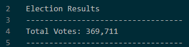
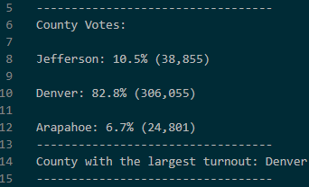
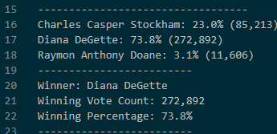
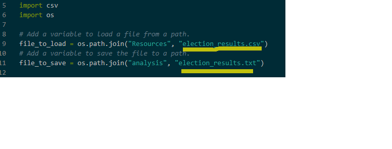

# Analysis of the Election Audit

## Overview of Election Audit
A Colorado Board of Elections employee needs to complete the election audit of 2019 local congressional election.
1.	Calculate the total number of votes cast.
2.	Get a complete list of candidates who received votes.
3.	Calculate the total number of votes.
4.	Calculate the percentage of votes each candidate won.
5.	Determine the winner of the election based on popular vote.
6.  Calculate the total number of votes by County.
7.  Calculate the percentage of votes by County.
8.  Determine the County with the largest turnout.

## Election-Audit Results
The analysis of election show that:
  -	There were 369,711 votes cast in the congressional election.
  
  

  - The results in each Couty were:
    - Jefferson with 38,855 number of votes.
    - Denver with 306,055 number of votes.
    - Arapahoe with 24,801 number of votes.
  - The County wit the largest turnout was Denver.
  
  

  -	The candidates where: 
    - Charles Casper Stockham
    - Diana DeGette
    - Raymon Anthony Doane
  -	The candidate results where:
     - Charles Casper Stockham received 23.0% of the vote and 85,213 number of votes.
     - Diana DeGette received 73.8% of the vote and 272,892 number of votes.
     - Raymon Anthony Doane received 3.1% of the vote and 11,606 number of votes.
  
  -	The winner of the election was:
    -	Candidate **Diana DeGette**, who received 73.8% of the vote and 272,892 number of votes.
    

## Election-Audit Summary
As result of this audit, we can recommend that the script presented for this analysis, can be used in other instances for other regions. 
For example, it can be used in other state with the list/file provided where all Counties of the States are recorded with the vote counts. As a result, we can summarize in an automatization process the results in the similar way as we are presenting in the Colorado State. 

Other instance where the script and analysis can be used is nationwide, presenting the comparing results of the election determining State by State and verifying the results for the whole nation.  

As is shown in the graph below, we can modify the codes highlighted and use the correspond file depending on the State/County or Nation/States to deliver the proper analysis.

